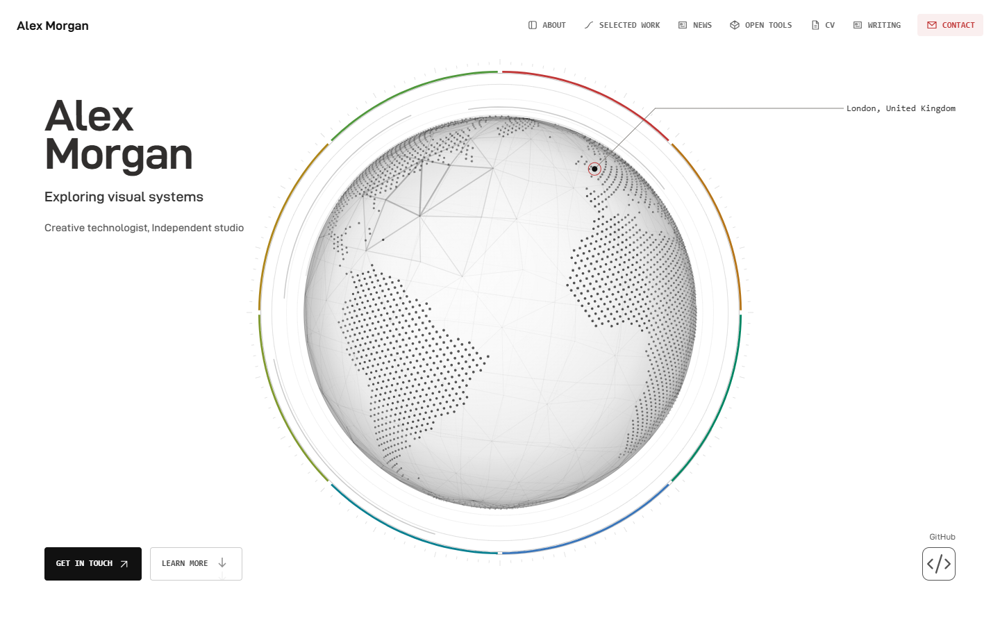
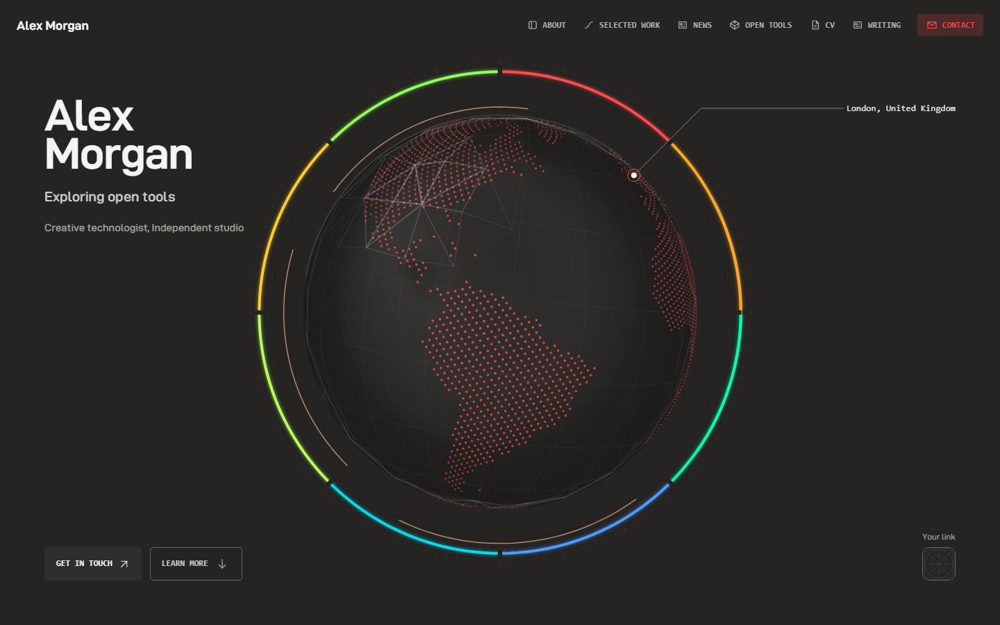

# FolioWeave

A **Next.js 16 portfolio framework** with selectable templates, shared plugins, and a content workflow for personal websites.

FolioWeave brings three portfolio designs into one application: Classic, Refract Light, and Refract Dark. Choose a template through the CLI, keep your profile and Markdown articles, and enable music or comments independently. Layout, motion, content publication, and extension contracts live in the reusable code; personal information and media stay in the authoring layer.

## Templates

| Template      | CLI id          | Design                                                                                         | Demo                                                     |
| ------------- | --------------- | ---------------------------------------------------------------------------------------------- | -------------------------------------------------------- |
| Classic       | `classic`       | Editorial portfolio with tactile objects, project stories, and photography                     | [Open demo](https://folioweave-classic.vercel.app)       |
| Refract Light | `refract-light` | White opening, contrasting dark sections, and a scroll-driven globe that separates and reforms | [Open demo](https://folioweave-refract-light.vercel.app) |
| Refract Dark  | `refract-dark`  | Warm dark opening, light drawing stages, and the same globe narrative in a distinct palette    | [Open demo](https://folioweave-refract-dark.vercel.app)  |

**In production:** [kukutx.vercel.app](https://kukutx.vercel.app) is the author's own portfolio, built with Classic from this repository's `personal` branch. The demos above use placeholder content; that site shows the template carrying real work.

Refract Light and Refract Dark are separate build-time choices. The published site has no style switcher. They share scene geometry and interaction code so fixes apply consistently to both designs. Read the [Refract guide](docs/REFRACT.md) for content mapping, settings, and asset credits.

|                                                                     Refract Light                                                                      |                                                                       Refract Dark                                                                        |
| :----------------------------------------------------------------------------------------------------------------------------------------------------: | :-------------------------------------------------------------------------------------------------------------------------------------------------------: |
| [](https://folioweave-refract-light.vercel.app) | [](https://folioweave-refract-dark.vercel.app) |

## Start here

Requirements: Node.js 24 and npm.

```bash
npm ci
git switch -c personal
npm run personalize
npm run folio -- templates
npm run folio -- template use refract-light
npm run dev
```

`main` and `develop` keep the canonical demo, so your own profile lives on the `personal` branch.

Use `classic` or `refract-dark` in the selection command to choose either of the other templates. Classic remains the default for profiles without a template selection.

Open `http://localhost:3000`.

For the guided five-minute path, read [docs/QUICKSTART.md](docs/QUICKSTART.md).

## What you edit

Normal personalization uses three places, plus an optional resume source:

```text
portfolio.json
content/assets/portfolio/
content/blogs/
content/resume/            optional
```

`portfolio.json` owns identity, location, links, Hero/About copy, projects, photography order, resume, Blog presentation, SEO, and feature switches.

`content/assets/portfolio/` owns original author media. Browser URLs remain `/portfolio/...`.

`content/blogs/` owns Markdown posts.

`content/resume/resume.json`, when present, is the single source for the resume PDF and the printer preview; `npm run resume:build` renders both.

Do **not** edit `public/portfolio/`, `src/portfolio/*.generated.*`, or `src/blog/posts.generated.ts`. They are validated publication output and are replaced by the content pipeline.

While `npm run dev` is running, valid changes to profile content, assets, Markdown, schema, custom-blog metadata, and the route registry are rebuilt automatically. Invalid content leaves the last valid generated output in place and prints the validation error.

## Highlights

- Three CLI-selectable templates sharing one profile schema and publication pipeline
- Independent music and comments plugins, configured through the CLI and mounted through template slots
- Responsive portfolio for desktop, tablet, and mobile
- Data-driven projects, photography, About content, resume, links, and feature switches
- One-source resume: a JSON file rendered to the printer preview and a tagged PDF whose text extracts in reading order
- Markdown Blog with automatic routes, index, tag pages, reading time, metadata, sitemap, and drafts
- Article outline, linkable section headings, and copyable code blocks
- Classic's editorial sections, camera, gallery/lightbox, and resume printer
- Refract's Canvas globe, scroll-driven scene changes, chapter timeline, and light/dark design variants
- Server-first composition with focused client interaction islands
- Accessibility-minded keyboard/focus behavior and live reduced-motion support
- Atomic content publication with schema, route, asset, image, and link validation
- Runtime, bundle, browser, media, lifecycle, visual, and profile QA
- Chromium, Firefox, and WebKit release coverage
- Explicit reusable-core vs demo vs author-content boundaries

## Add content

### Project

Put source artwork under:

```text
content/assets/portfolio/projects/my-app/
```

then add the project to `portfolio.json > projects`. Image dimensions are measured automatically. Projects support single images, carousels, mobile art direction, actions, badges, and an optional editorial story.

### Photography

Add originals under `content/assets/portfolio/photography/` and reference them in `portfolio.json > photography.images`.

### Blog

Create `content/blogs/my-post.md`:

```md
---
title: "My post"
date: "2026-09-12"
description: "A short summary."
tags:
  - Engineering
draft: false
---

## A section

Normal Markdown.
```

It becomes `/blogs/my-post`. The Blog index appears automatically when at least one post is published. With local development already running, adding/removing the file updates the route without restarting Next.

### Resume

Point `portfolio.json > site.resume` at two files under `/portfolio/resume/`, copy `content/resume/resume.example.json` to `content/resume/resume.json`, edit it, and run:

```bash
npm run resume:build
```

That writes the PDF and preview `site.resume` references. The build fails if they ever fall behind the source, so the published resume is always the current one. [content/resume/README.md](content/resume/README.md) has the details.

See [docs/RECIPES.md](docs/RECIPES.md) for copyable examples.

## Architecture

FolioWeave separates four concerns:

```text
Reusable core
  src/core/
  src/templates/
  src/plugins/
  src/components/
  src/config/
  src/content/
  src/hooks/
  src/lib/
  src/portfolio/
  src/styles/

Demo / examples
  src/demo/
  thin filesystem route entries under src/app/(demo)/

Author inputs
  portfolio.json
  content/assets/portfolio/
  content/blogs/
  content/resume/

Generated publication
  public/portfolio/
  src/portfolio/*.generated.ts
  src/blog/posts.generated.ts
```

Reusable modules are not allowed to depend on `src/demo/`; `npm run qa:boundary` enforces that rule.

FolioWeave shares one content and publication core across selectable templates. Each template implements the same layout, home, blog index, article, and tag-page contracts. Trusted local plugins add independent features through semantic slots. Use `npm run folio -- templates`, `npm run folio -- plugins`, and `npm run folio -- doctor`. See [Template integration](docs/TEMPLATES.md) and [Shared plugins](docs/PLUGINS.md).

Read [docs/ARCHITECTURE.md](docs/ARCHITECTURE.md) for the full contracts.

## Design philosophy

Each template owns its visual language. Classic uses editorial layouts and tactile software objects. Refract uses a continuous globe scene, layered geometry, and chapter-based scrolling. Shared content and extension contracts allow those designs to coexist without making their layouts identical.

An approved visual is treated as a compatibility contract. Refactors and performance work must not silently redesign it. Visual baseline updates require an understood, intentional change rather than “making tests green.”

See [docs/DESIGN-SYSTEM.md](docs/DESIGN-SYSTEM.md) and [docs/VISUAL-QA.md](docs/VISUAL-QA.md).

## Validation

Fast content validation:

```bash
npm run content:check
```

Production build, which publishes and validates your content first:

```bash
npm run build
```

That is everything a personal site needs. Maintainers changing shared code run the
full gate, which adds lint, the branch boundary and the content test suites:

```bash
npm run check
npm run audit:prod
```

Design-specific validation:

```bash
npm run qa:maintainer
npm run qa:refract
```

`qa:maintainer` exercises Classic's runtime budgets, interaction/accessibility, media health, bundle budgets, reusable fixtures, profile variants, visual regression, and Chromium/Firefox/WebKit. Run it against a Classic build. `qa:refract` builds both Refract styles in isolated demo fixtures and checks their scene contracts and browser behavior. It does not replace your author profile. Each design has its own visual contract; passing one suite does not validate all templates.

## Deployment

FolioWeave uses standard Next.js deployment conventions. Vercel can use the normal Next.js preset; other platforms that support the current Next.js runtime can use their standard adapter.

Set `site.origin` in `portfolio.json` to the canonical production URL before release, and validate the production build.

On Vercel, import the repository and set **Settings → Environments → Production → Branch Tracking** to `personal`. A new project tracks `main` by default, which publishes the bundled demo profile instead of yours. See [docs/DEPLOYMENT.md](docs/DEPLOYMENT.md).

## Public repository and personal profile

FolioWeave uses one public repository. `main`/`develop` keep the reusable starter
and canonical demo clean, while `personal` carries the maintained public author
profile and its media. The branch split protects template ownership, not privacy.

Only commit material intended for public access; secrets and confidential content
must stay outside Git history. See
[docs/REPOSITORY-MODEL.md](docs/REPOSITORY-MODEL.md) for the shared-change,
personal-content, and downstream/fork workflow.

## Documentation

- [Five-minute quick start](docs/QUICKSTART.md)
- [Personalization reference](docs/PERSONALIZATION.md)
- [Common recipes](docs/RECIPES.md)
- [Design system](docs/DESIGN-SYSTEM.md)
- [Architecture](docs/ARCHITECTURE.md)
- [Extending the template](docs/TEMPLATE.md)
- [Selecting and integrating templates](docs/TEMPLATES.md)
- [Refract Light and Refract Dark](docs/REFRACT.md)
- [Music, comments and plugin development](docs/PLUGINS.md)
- [Deployment](docs/DEPLOYMENT.md)
- [Upgrading](docs/UPGRADING.md)
- [Visual QA](docs/VISUAL-QA.md)
- [Repository model](docs/REPOSITORY-MODEL.md)
- [Branch/repository boundaries](docs/BRANCHING.md)
- [Asset policy](docs/ASSETS.md)

## Demo routes and media

The canonical starter contains complete example/product routes so the project is demonstrable after cloning. Their implementation is isolated under `src/demo/`. Setting `features.demoRoutes: false` removes them from the published route set, sitemap, and QA targets while keeping the example source available for reference.

The MIT license covers software and documentation. It does not automatically grant reuse/redistribution rights for every bundled photo, logo, trademark, font, or product screenshot. Review [docs/ASSETS.md](docs/ASSETS.md) before publishing or redistributing demo media.

## License

Software source and documentation are licensed under the [MIT License](LICENSE).
